# Workflow Architecture

This directory contains the reorganized workflow components for better maintainability and separation of concerns.

## Structure

```
workflow/
├── __init__.py          # Main workflow exports
├── config.py            # LLM and configuration
├── graph.py             # Workflow graph definition
├── control.py           # Control flow logic
└── nodes/               # Individual workflow nodes
    ├── __init__.py      # Node exports
    ├── cache.py         # Network caching and initialization
    ├── planner.py       # Action planning with context-aware status
    ├── executor.py      # Safe action execution with validation
    ├── validator.py     # Result validation and rollback logic
    ├── summarizer.py    # Action summary generation
    └── explainer.py     # Explanation and training data collection
```

## Key Benefits

1. **Separation of Concerns**: Each node has its own file with focused responsibility
2. **Better Maintainability**: Easier to understand, test, and modify individual components
3. **Cleaner Dependencies**: Clear import structure and dependency management
4. **Testability**: Each node can be tested independently
5. **Backward Compatibility**: Original `graph.py` still works via delegation

## Usage

The reorganization is transparent to existing code:

```python
# This still works as before
from faraday.agents.graph import get_workflow

# Individual nodes can also be imported
from faraday.agents.graph import planner, executor, summarizer

# Or directly from the new structure
from faraday.agents.workflow import get_workflow
from faraday.agents.workflow.nodes import planner, executor
```

## Node Responsibilities

- **cache.py**: Initializes working directories and preserves original network state
- **planner.py**: Context-aware planning with adaptive status representations for different network sizes
- **executor.py**: Safe execution on network copies with power flow validation
- **validator.py**: Validates changes and determines rollback requirements
- **summarizer.py**: Generates action summaries for reporting
- **explainer.py**: Creates explanations and collects training data

## Workflow Flowchart

```mermaid
flowchart TD
    Start([START]) --> Cache[cache_network<br/>📁 Create working copy<br/>Preserve original network]
    
    Cache --> Planner[planner<br/>🧠 Analyze network status<br/>Generate action plan<br/>Context-aware planning]
    
    Planner --> Executor[executor<br/>⚡ Execute actions safely<br/>Validate power flow<br/>Update network state]
    
    Executor --> Validator[validator<br/>✅ Validate changes<br/>Check improvements<br/>Determine rollback]
    
    Validator --> Decision{should_continue?<br/>Check conditions}
    
    Decision -->|"iter >= 5<br/>OR failed_execution"| Summarizer[summarizer<br/>📝 Generate summary<br/>Report actions taken]
    
    Decision -->|"violations remain<br/>AND iter < 5"| Planner
    
    Decision -->|"no violations<br/>OR success"| Summarizer
    
    Summarizer --> Explainer[explainer<br/>📚 Generate explanation<br/>Collect training data<br/>Save conversation]
    
    Explainer --> End([END])
    
    %% Styling
    classDef startEnd fill:#e1f5fe,stroke:#01579b,stroke-width:2px
    classDef process fill:#f3e5f5,stroke:#4a148c,stroke-width:2px
    classDef decision fill:#fff3e0,stroke:#e65100,stroke-width:2px
    classDef loop fill:#e8f5e8,stroke:#1b5e20,stroke-width:2px
    
    class Start,End startEnd
    class Cache,Executor,Summarizer,Explainer process
    class Decision decision
    class Planner,Validator loop
```



## Detailed Flow Description

### 1. **Initialization Phase**
- **cache_network**: Creates a working directory with unique UUID, copies the original network file, and preserves the original state for potential rollback

### 2. **Planning Phase** 
- **planner**: 
  - Analyzes current network status using context-aware representations
  - Selects optimal status mode based on network size (full/hierarchical/graph/adaptive)
  - Generates structured action plan using LLM with tools
  - Extracts current violations for baseline comparison

### 3. **Execution Phase**
- **executor**:
  - Creates temporary copy of current network for safe execution
  - Executes action plan using appropriate executor (standard/optimized)
  - Validates power flow convergence
  - Updates network state only on successful execution

### 4. **Validation Phase**
- **validator**:
  - Checks execution success/failure
  - Compares violation counts before/after actions
  - Determines if improvements were made
  - Sets rollback flags if needed

### 5. **Control Flow Decision**
The `should_continue` function determines the next step based on:
- **Continue to planner** if:
  - Violations still exist (voltage or thermal)
  - Iteration count < 5
  - No execution failures
- **Go to summarizer** if:
  - Maximum iterations reached (≥5)
  - Execution failed
  - All violations resolved

### 6. **Completion Phase**
- **summarizer**: Generates human-readable summary of all executed actions
- **explainer**: Creates detailed explanations and collects training data for model improvement

## State Management

The workflow maintains comprehensive state tracking:
- **Original Network**: Immutable reference for rollback
- **Current Network**: Working state with successful changes
- **Iteration Results**: History of all attempts with success/failure status
- **Successful Changes**: Accumulated list of validated actions
- **Violation Tracking**: Before/after comparison for each iteration